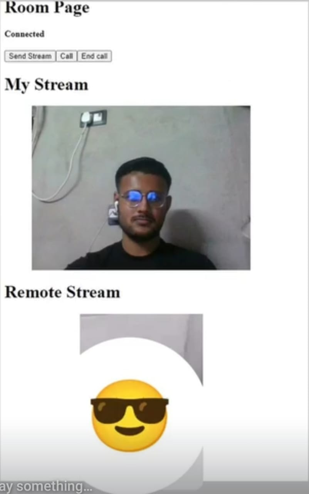

# ✅ Sever for Video App

This is a demo Video Calling app to talk to your friend by both joining in a room. The code base is extremely simple and can be used to learn how to use web sockets to build 
such tool. This is server side program. Ofcourse the idea can be extended to connect many people in a single room. However, that has not been implemented here, as this was used to 
as a base project to build Moviecom, an absolute masterclass of creativity and innovation. This one is fully written in React.

You can check client side code at https://github.com/sauravatgithub-web/serverVideo. 
---

## 🚀 Live Preview

You can visit the website at https://client-video-beta.vercel.app/

---

## 📷 Site Images

